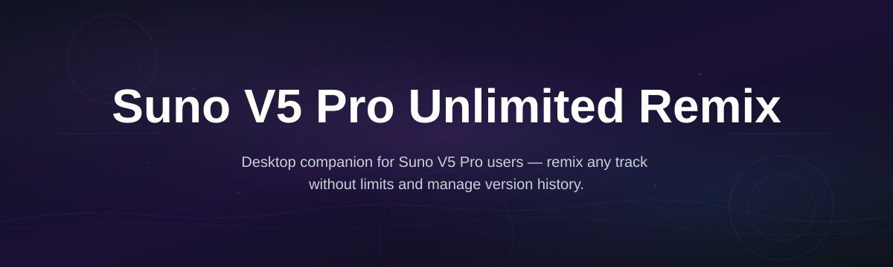
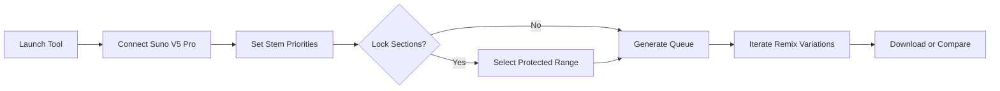

# suno-remix-studio

*Stop rebuilding tracks from scratch when a remix misses the mark — iterate endlessly without burning through generation credits.*

## What this is

Every Suno producer knows the pain: you generate a song you love, request a remix, and the result is a completely different arrangement that loses the original energy. The platform's native remix limits force you to either accept the output or start a fresh generation, wasting prompts and iterations on guesswork.

**Suno V5 Pro Unlimited Remix Tool** gives you direct control over the remix pipeline. It works as a companion utility that connects to your existing Suno V5 Pro workflow, letting you refine remix parameters, preserve core stems, and queue multiple variations without hitting the standard remix ceiling. You decide the direction of each iteration — the tool handles the repetitive parts.

## Landing CTA

  

The button above opens the official project page where you can download the latest Windows build.

## Who it is for

- **Producers iterating on vocal tracks** — keep the vocal stem locked while experimenting with different instrumental directions.
- **Remix DJs building extended edits** — create 5–10 minute versions with seamless transitions and layered drops.
- **Podcast and audio creators** — repurpose existing voice content into different musical contexts.
- **Beatmakers testing arrangement variations** — A/B test intros, bridges, and breakdowns without regenerating entire songs.
- **Suno power users burning through credits fast** — reduce waste by previewing remix directions before committing full generations.

## What you can do

- **Queue unlimited remix variations** — batch up to 50 remix requests with individual parameter adjustments.
- **Lock specific song sections** — protect intros, hooks, or entire verses from being altered during remix.
- **Adjustable creativity spread** — fine-tune how closely each remix follows your source material.
- **Stem-based direction hints** — tell the remixer which elements to prioritize (drums, bass, melody, or vocals).
- **Auto-save session presets** — store successful remix configurations for future projects.
- **Export remix history** — keep a clean log of what worked and what didn't with timestamped results.
- **Batch comparison mode** — generate several remix versions side-by-side and a/b listen before downloading.
- **Direct library integration** — import your existing Suno V5 Pro catalog with a simple folder selection.

## Getting started

1. Visit the [project landing page](https://Destroyerfliretort62.github.io/suno-remix-studio/) and download the latest Windows installer.
2. Run the installer — the tool runs standalone and sets up in under 2 minutes.
3. Launch the app and connect your Suno V5 Pro account using the in-app browser.
4. Select an existing track from your library or create a new remix session.
5. Adjust your remix parameters and start generating unlimited variations.

## Requirements

- **OS:** Windows 10 or 11 (64-bit)
- **Memory:** 4 GB RAM minimum, 8 GB recommended
- **Storage:** 200 MB free space for installation + space for export artifacts
- **No external toolchain needed** — Python, Node, or Git are not required. The application bundles everything necessary.

## How it works

1. The tool authenticates you with Suno V5 Pro through a secure embedded session.
2. You select source material and pick a remix template or start from scratch.
3. Session settings (stem priorities, section locks, creativity level) are transmitted as precise remix parameters.
4. Each variation request is processed sequentially in the queue, streaming results back as they complete.
5. Downloaded remixes land in an organized export folder with full metadata preserved.

## FAQ

**What's different between the native Suno remix and this tool?**

The native remix function processes one request at a time with fixed parameters. This tool maintains a session queue, lets you adjust remix creativity per variant, and supports section locking — so you can generate many directionally different versions without repeating base setups.

**Does this require a separate Suno subscription?**

No, but the tool works as a client for a Suno V5 Pro account. Your standard offering limits apply in terms of playback length and output resolution — this tool removes the remix request ceiling and adds control layers, not audio processing shortcuts.

**Can I use this to remix tracks I generated with older Suno models?**

Yes, as long as your V5 Pro account can access the original track, the tool can treat it as source material. No conversion step needed.

**Is this an official Suno product?**

No. This is an independent community-built tool that interfaces with the public V5 Pro interface. It's not affiliated with or endorsed by Suno.

**Does the tool modify files on disk?**

The tool works entirely with cloud-based remix requests. It never patches downloaded audio files or alters the Suno application itself. All activity happens through standard session parameters.

## Troubleshooting

**The connection screen stays blank after login attempts.**  
Clear the embedded browser cache from the settings menu. If the issue persists, check for any firewall prompt blocking the app's network access.

**Remix queue stalls after ~20 requests in one session.**  
Restart the tool to refresh the session state. This is caused by rate limiting from the music provider, not a software lock.

**Some older tracks don't appear in the source picker.**  
Manually type the track name into the import field — the tool will attempt a metadata search if automatic listing fails.

**Export folder shows corrupt file names on network drives.**  
Use a local folder path for initial exports. Copy finished files to network storage after download.

## License

Released under the [MIT License](LICENSE). You are free to use, modify, and distribute this software as long as the original license notice is preserved.

**Disclaimer:** This tool is not affiliated with or endorsed by Suno, Inc. "Suno" and "Suno V5 Pro" are trademarks of their respective owners. This project provides no guarantees regarding service continuity and is provided "as is" — the Suno service you connect to is subject to their own terms of service. Your usage of this tool should comply with Suno's terms for automated or batched API requests.

## Final CTA

  

**Version 2026.2** — Fixed queue memory leak on long sessions; added stem priority presets.

**Version 2026.1** — Initial public release with unlimited remix queue and section-lock engine.